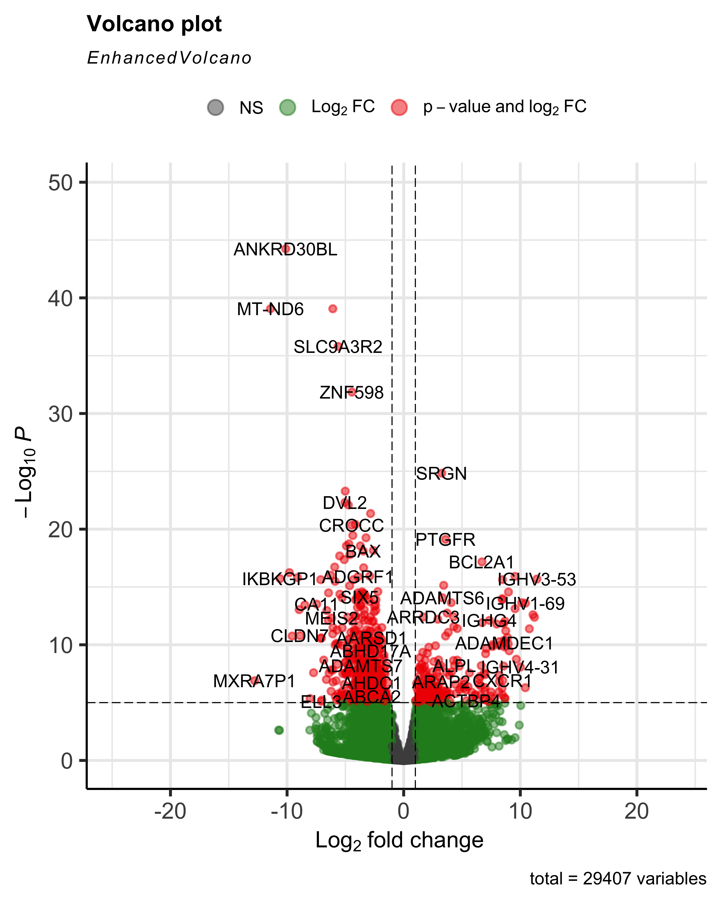
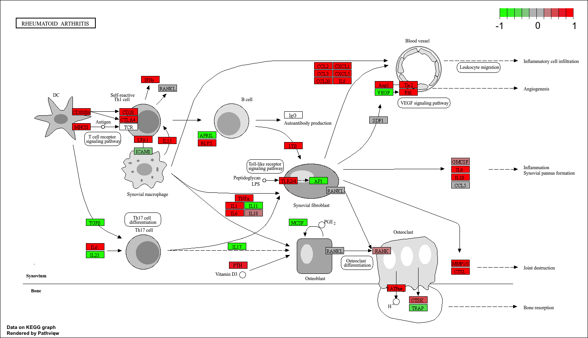

<meta charset="UTF-8">

# reuma-08-05

## Inleiding

**Reumatoïe artritis** (RA) is een chronische, systemische auto-immuunziekte die wereldwijd ongeveer 0,3/0,5-1% van de bevolking treft (Gabriel, 2001; Platzer et al., 2019). Het treft vrouwen vaker van mannen (Gabriel, 2001; Majithia & Geraci, 2007; Platzer et al., 2019). Deze ontstekingsziekte ontstaat doordat het afweersysteem de eigen gewrichten aan, waardoor zowel grote als kleine gewrichten ontstoken raken (Majithia & Geraci, 2007). De exacte oorzaak van RA is nog niet volledig bekend maar de ziekte ontstaat vermoedelijk door een complexe interactie tussen genetische aanleg, verandering in genexpressie, omgevingsfactoren en een ontregeld immuunsysteem (Platzer et al., 2019). Omdat blijvende schade al vroeg kan ontstaan tijdens de ziekte door aanhoudende ontsteking (Platzer et al., 2019), is een snelle diagnose en behandeling essentieel. Hoewel verschillende geneesmiddelen de ziekteactiviteit kunnen remmen, bestaat er momenteel geen genezende therapie. 
Door de grote variatie in symptomen en behandelrespons wordt aangenomen dat RA uit meerdere subtypen bestaat (Platzer et al., 2019). Transcriptomics kan hierin waardevolle mogelijkheden bieden. Met methoden zoals RNA-sequencing kan de expressie van duizenden genen tegelijk worden onderzocht waardoor er een overzicht ontstaat in moleculaire mechanismen en signaalroutes (Robles-Remacho et al., 2023). Aangezien RA een ontstekingsreactie geeft in het weefsel, kan transcriptomics een mogelijke bijdrage leveren aan een betere diagnose.
==> Moet nog een doelstelling in

## Materiaal en methode
Voor deze transcriptomics analyse werden RNA-sequenties gebruikt afkomstig uit de studie van platzer et al. (2019). In deze studie werden synoviumbiopten verzameld van 4 gezonde individuen, en 4 patiënten met vastgestelde Reumatoïde artritis (RA) uit het gewrichtsslijmvlies. Alle deelnemers waren tussen de 15 en 66 jaar en vrouwelijk. De gebruikte samples zijn:
SRR4785819

31
Vrouw
Normaal
SRR4785820

15
Vrouw
Normaal
SRR4785828

31
Vrouw
Normaal
SRR4785831

42
Vrouw
Normaal
SRR4785979

54
Vrouw
RA
SRR4785980

66
Vrouw
RA
SRR4785986

60
Vrouw
RA
SRR4785988

59
Vrouw
RA
De ruwe RNA-seq FASTQ bestanden werden vanuit de Sequence Read Archive (SRA) gedownload. De verdere analyse werd uitgevoerd in R. 

Alle analyses werden uitgevoerd in R (versie ? 4.0) op macOS. De volgende Bioconductor- packages werden gebruikt: Rsubread, Rsamtools, DESeg2, EnhancedVolcano, goseq, geneLenDataBase, org.Hs.eg.db, clusterProfiler, pathview en ggplot2. Alle packages werden geïnstalleerd via BiocManager. 

Het humane referentiegenoom (GCF_000001405.40) en de GTF-annotatie werden gedownload vanaf NCBI. Met de functie buildindex() uit Rsubread werd een genoomindex aangemaakt: memory = 4000, indexSlit = TRUE en basename = “ref_humaan”.

Voor elk sample werden de paired-end FASTQ-bestanden uitgelijnd tegen het humane referentiegenoom met de functie align(). Dit resulteerde in 8 BAM-bestanden (nor1,2,3,4 en ra1,2,3,4).

Hierna werden de 8 BAM-bestanden gesorteerd via sortBam() en geïndexeerd met indexBam()

Hierna werden de genexpressieniveau’s bepaald door featureCounts:
isPairedEnd = TRUE, isGTFAnnotationFile = TRUE, GTF.attrType = “gene_id”, use MetaFeatures = TRUE. De count matrix werd hierna opgeslagen als csv bestand. 

De counts werden ingelezen en gecombineerd in een metadata-tabel waarin de condities waren vastgelegd: control (NOR) en reuma (RA). Significante genen werden gedefinieerd als padj < 0.05 en log2FoldChange > 1.

Voor de visualisatie van differentiële expressie werd een volcanoplot gegenereerd met EnhancedVolcano waarin log2FoldChange (x-as) en padj (y-as) werden weergegeven en opgeslagen als PNG. 

Omdat RNA-seq gevoelig is voor genlengte-bias (ff ander woord voor zoeken) werd goseq gebruikt. Hierin werd een binaire vector gemaakt met onderscheid tussen wel of niet differentieel tot expressie komt.

Voor een KEGG-analyse moesten de genen omgezet worden naar Entrez-ID’s. met bitr() werden SYMBOL -> ENTREZID conversies uitgevoerd (wat betekend conversies?). Met pathview werden genexpressiewijzigingen geprojecteerd op KEGG-pathways (hsa05323 – RA, hsa04010 – MAPK signaling pathway).

## Resultaten

**Verhoogde expressie van immuunglobuline- en ontsteking gerelateerde genen in Reumatoïde artritis vergeleken met de controlegroep.**

De RNA-seq analyse van synoviaal weefsel van patiënten met RA vergeleken met controle (gezonde mensen) lieten duidelijke verschillen zien in genexpressie. In totaal werden er 29407 genen getest op differentiële expressie en deze resultaten zijn in een volcano plot (figuur 1) uitgezet. Op basis van de drempels padj < 0.05 en log2FC > 1 is er een significante toe- of afname zichtbaar in verschillende immuunglobuline-gerelateerde genen en ontsteking gerelateerde genen. Figuur 1 toont 3 groepen genen: Grijs: niet-significante genen, groen: genen met grote fold-change maar niet significant en rood: genen die een grote fold change hebben en significant zijn.

  

Meerdere genen hebben een hoge absolute log2foldchange en een lage p-waarde waardoor er een grote significante differentiële expressie wordt aangetoond. Zo is er een sterke toename in regulatie van verschillende immuunglobuline-gerelateerde genen, waaronder IGHV3-53, IGHV1-69, IGHV4 en IGHV4-31. Deze verhoogde expressie wijst op een sterke activatie van B-cellen waardoor de auto-antistof productie hoog aanwezig is. Dat is een kenmerkend mechanisme in RA. https://pmc.ncbi.nlm.nih.gov/articles/PMC11155132/   https://nyaspubs.onlinelibrary.wiley.com/doi/abs/10.1111/j.1749-6632.1997.tb52074.x?sid=nlm%3Apubmed 
Daarnaast werden inflammatiegenen zoals CXCR1, PTGFR, BAX en CRACC verhoogd tot expressie gebracht. Dit betekent dat immunactivatie en ontstekingssignalering sterk aanwezig is in de onderzochte monsters. https://pubmed.ncbi.nlm.nih.gov/17976416/ ook een belangrijk symptoom van RA is ontsteking.

**Verhoogde activatie van ontsteking-, chemokine- en immuunroutes in de KEGG-pathway**

De KEGG pathway analyse van de rheumatoid arthritis pathway toonde een sterke activatie van inflammatoire en immuun ondersteunende signaalroutes. Verschillende cytokines, waaronder TNF?, IL6, IL1?, IL15 en IFN?, waren verhoogd in tegenstelling tot de controle, wat kan betekenen op een actieve ontsteking in het synovium. https://www.researchgate.net/profile/Jagdish-Joshi/publication/309303196_Cytokines_and_their_Role_in_Health_and_Disease_A_Brief_Overview/links/59029b26aca2725bd7223c13/Cytokines-and-their-Role-in-Health-and-Disease-A-Brief-Overview.pdf https://www.termedia.pl/The-role-of-cytokines-and-chemokines-in-the-inflammatory-response,123,51557,1,0.html  Daarnaast werd verhoogde expressie waargenomen van chemokines zoals CCL2, CCL3, CCL20, CXCL1, CXCL5 en IL8, die betrokken zijn bij ontsteking van in dit geval het gewricht https://www.termedia.pl/The-role-of-cytokines-and-chemokines-in-the-inflammatory-response,123,51557,1,0.html . De analyse liet ook activatie zien van T-cel gerelateerde signalering, waaronder verhoogde expressie van CD28, CTLA4 en CD86, wat duidt op versterkte adaptieve immuunresponsen https://www.nature.com/articles/s41392-023-01471-y . Tenslotte werden genen geassocieerd met osteoclasten, zoals MMP13, CTSK en RANK ook een verhoogde waarde zien. Osteoclasten zijn kleine cellen in het lichaam die botten afbreken https://www.sciencedirect.com/science/article/abs/pii/S8756328206007009 . 

  

Deze pathway analyse bevestigt dat de onderzochte monsters van de zieke patiënten last hebben van ontstoken gewrichten en het immuunsysteem het gewricht aanvalt.

## Conclusie
Op basis van de uitgevoerde RNA-seq analyse van synoviaal weefsel uit reumatoïde artritis (RA) en gezonde controles kan geconcludeerd worden dat er een verhoogde ontstekingsactiviteit en immuun activatie is. De analyse van de KEGG-pathway laat zien dat er een groot aantal aan genen significant verhoogd of verlaagd tot expressie komen in RA. Veel van deze genen zijn betrokken bij cytokinesignalering, chemokine productie en immuuncelactivatie, wat past bij de kenmerken van wat bekend is van RA. 
De GO-analyse bevestigde dat vooral processen gerelateerd aan ontsteking, immuunrespons en celactivatie verhoogd zijn. De KEGG-analyse laat zien dat meerdere routes sterk stegen in activatie, waaronder de T cell receptor signaling pathway, Toll-like receptor, osteoclast differentiatie en de VEGF signaling pathway.
De resultaten sluiten goed aan bij de bevindingen uit de studie van Platzer et al. (2019). Hieruit is de gebruikte dataset afkomstig. De combinatie van de DE-analyse, GO-verrijking en de KEGG-pathway visualisatie geeft een goed beeld van RA door ontstekingen en auto-immuun activatie.
